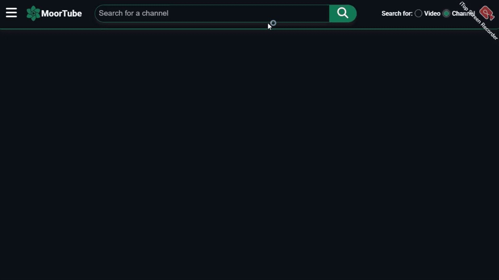
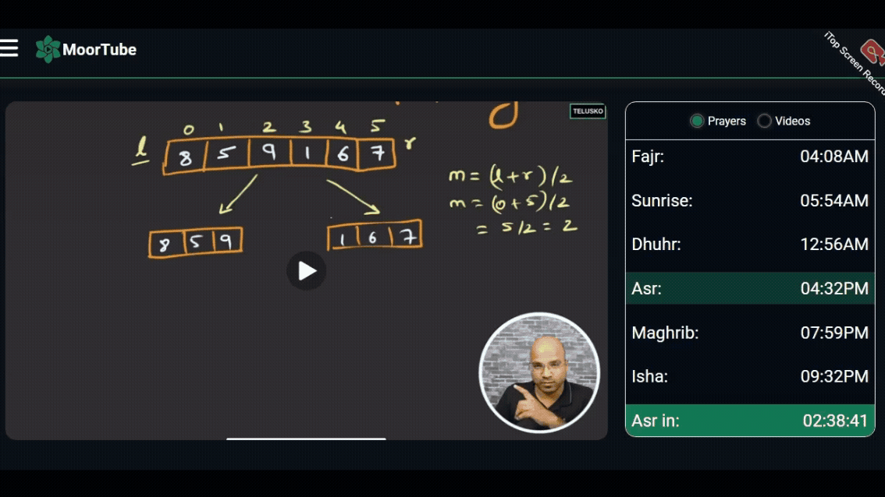
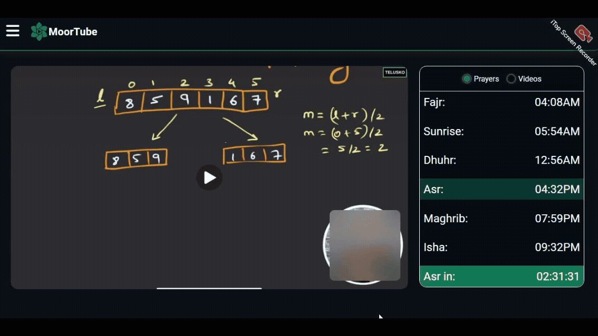
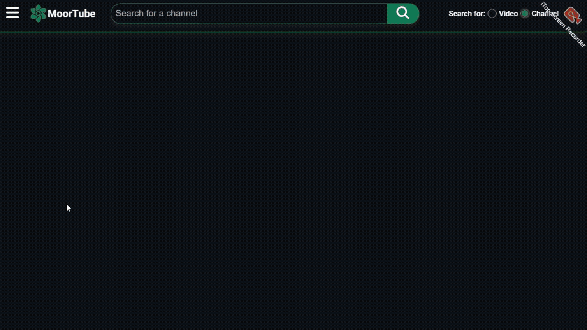

#  MoorTube - The Future Of Video Players

A video player that is built on top of the YouTube API with many productivity features to help you watch YouTube videos with more ***deliberation***.

## 🎯 Project Overview

MoorTube is a video player that feeds from the YouTube API and is built with intention to solve some of the most **anti-productivity and anti time-awareness** and distractive YouTube features. It incorporates many features like creating curated watchlists and **subplaylists**, **notepads for notetaking**, **safe search**, **content blurring tools**, and many more to come.

## ✨ Core Features

### 1. Safe Search



### 2. Blur Tools



### 3. Notepads



### 4. Sub-playlists



**Note:** These are just some of the app's features. There is a lot more than that and a lot more to come.

## 🏨 Repository Structure

```text
├── /backend
│   ├── /src
│   │   ├── /config
│   │   ├── /controllers
│   │   ├── /middleware
│   │   ├── /models
│   │   ├── /routes
│   │   ├── /types
│   │   ├── /utils
│   │   ├── app.ts
│   │   └── server.ts
│   ├── .env
│   ├── package.json
│   ├── README.md
│   └── tsconfig.json
├── /frontend
│   ├── /public
│   ├── /src
│   │   ├── /api
│   │   ├── /assets
│   │   ├── /components
│   │   ├── /pages
│   │   ├── /types
│   |   ├── /utils
│   │   ├── App.tsx
│   │   ├── global.d.ts
│   │   ├── index.scss
│   │   ├── main.tsx
│   │   └── vite-env.d.ts
│   ├── .env
│   ├── eslint.config.js
│   ├── index.html
│   ├── package.json
│   ├── README.md
│   ├── tsconfig.json
│   └── vite.config.js
├── .gitignore
├── package.json
└── README.md
```

## 🔨 Tech Stack
  - **Frontend**
    - React
    - TypeScript
    - SCSS
    - Vite
  - **Backend**
    - Express
    - Nodejs
    - TypeScript
  - **Database**
    - MongoDB Atlas

## ⚙ Prerequisites
- Nodejs (V24) ─> [click to install.](https://nodejs.org/en/download)
- MongoDB running locally or URI string. ─> [mongodb.com](https://mongodb.com)

## 🚀 Getting Started
  **1. Clone Repo**
  ```bash
    git clone https://github.com/Mahmoud-solaiman/moortube
    cd moortube
  ```
  **2. 📦Install Dependencies** 
  ```bash
    npm install
  ```
  **3. 📦Install Frontend Dependencies**
  ```bash
    cd frontend
    npm install
  ```
  **4. 📦Install Backend Dependencies**
  ```bash
    cd backend
    npm install
  ```
  **5. 🔐Create .env files for frontend & backend**  
  **📁Frontend**
  ```env
  VITE_BACKEND_URL=http://localhost:8080
  VITE_FRONTEND_URL=http://localhost:5173
  ```
  **📁Backend**
  ```env
  PORT=8080
  MONGODB_URI=your_mongodb_uri
  JWT_SECRET_KEY=your_jwt_secret_key
  YOUTUBE_API_KEY=your_youtube_api_key
  ```
  You can head to [console.cloud.google.com](https://console.cloud.google.com/) to configure your own YouTube API key or head to [the backend README](./backend/README.md) for more details.

  **6. Start the project**  
  In the root directory you can run the following command to start both the frontend and the backend
  ```bash
    npm start
  ```
  **📝Note:** You can still start the frontend and the backend independent from one another by running the following commands:

  **To start the frontend**
  ```bash
    cd frontend
    npm start
  ```
  **To start the backend**
  ```bash
    cd backend
    npm start
  ```

**For more stack-specific details you can head to the [Frontend Docs](./frontend/README.md) or to the [Backend Docs](./backend/README.md).**